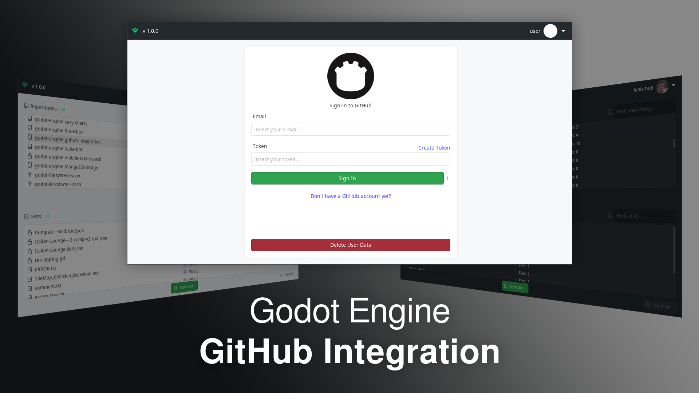

Check my **[Discord](https://discord.gg/KnJGY9S)** to stay updated on this repository.  
*(Recommended since the AssetLibrary is not automatically updated)*  

This plugin is now supported in [Godot Extended Library Discord](https://discord.gg/JNrcucg), check out the [Godot Extended Library Project](https://github.com/godot-extended-libraries)!

# GitHub Integration
A complete GitHub integration for your Godot Editor! Manage your project without even opening your browser.

Author: *"Nicolo (fenix) Santilio"*  
Version: *1.2.1*  
Wiki: *[supported](https://github.com/fenix-hub/godot-engine.github-integration/wiki)*  
Godot Version: *3.2.3beta1*  

## What is this?
*GitHub Integration* is a addon for Godot Engine that I've created mainly for a personal purpose.  
Pushing and Pulling personal repositories while I'm working on Godot (especially if I'm under a GameJam) could take some time and force me to save the project, open the brwoser/git bash/git gui, and do all the stuff.  
With this little addon which works directly in the editor, managing all your repositories will be very easy.  

## How does it work?
I'm currently working on a [Wiki](https://github.com/fenix-hub/godot-engine.github-integration/wiki) for this plugin. It is a process that will take some time to complete since I want to provide a well-organized wiki with some basic explanations about GitHub itself. Anyway, I'm working on a user-friendly plugin, so everything should be the very ease to use for GitHub experienced users, and a little intuitive for people who never used GitHub or are not so experienced.
If you want to see some screenshots you can find them here `addons/github-integration/screenshots`

## Supporters page
<table>
  <tr>
    <th>
    <th></th> 
  </tr>
  <tr>
    <th><a href="https://github.com/masterworm2">masterworm2</a></th>
    <th><a href="https://github.com/autcru">autcru</a></th>
  </tr>
</table>

For my first donation I decided to add a SUPPORTERS.md file where there is a list of people who decided to financially support this plugin. I will never ask for anything in return for the free service I want to offer to  Godot's community, but it will always be an act of kindness that will encourage me to keep my plugins and projects updated.
Here's the [Supporters List](./SUPPORTERS.md)

## :warning: Disclaimer  
This addon was built for a **personal use** intention. It was released as an open source plugin in the hope that it could be useful to the Godot Engine Community.  
As a "work in progress" project, there is *no warranty* for any eventual issue and bug that may broke your project.  
I don't assume any responsibility for possible corruptions of your project. It is always advisable to keep a copy of your project and check any changes you make in your Github repository.  

-----------------
> This text file was created via [TextEditor Integration](https://github.com/fenix-hub/godot-engine.text-editor) inside Godot Engine's Editor.

